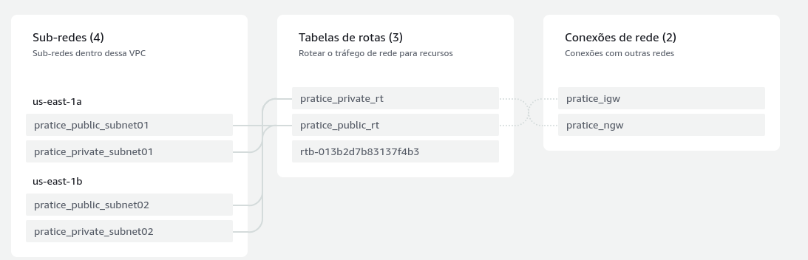
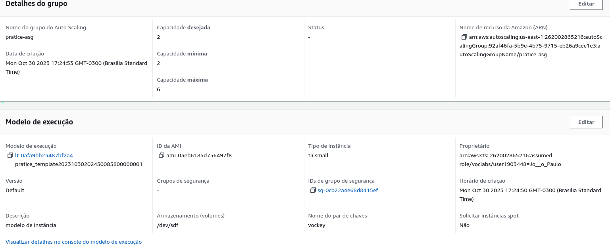
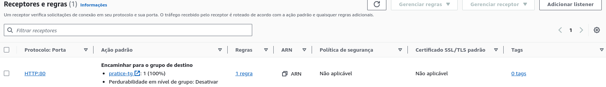

# Atividade Docker - DevSecOps
A segunda etapa de um ciclo de sprints preparatório para DevSecOps envolve a aplicação dos conhecimentos adquiridos na 5ª sprint, que trataram de temas relacionados à AWS (Amazon Web Services) e Docker.

## Requisitos para a Atividade.

### Requisitos AWS:
- Configuração do serviço de Load Balacer.
- Configuração do serviço de Auto Scaling.
- Configuração do serviço de RDS database mysql.
- Configuração do serviço de EFS para arquivos estáticos do container de aplicação wordpress.
- Configuração de uma VPC própria.
### Requisitos no Linux:
- Instalação e configuração do Docker no host EC2.
## Cenário de implementação.

## Desenvolvimento da Atividade.
### Stage 1 - Configuration
#### Configuração da VPC.
Criei uma infraestrutura na nuvem com a ajuda de uma Virtual Private Cloud (VPC) como base. Essa VPC é o alicerce da minha infraestrutura, que proporciona isolamento e controle total sobre a conectividade dos meus recursos na nuvem. Ao configurá-la, defini duas categorias de sub-redes: 2 sub-redes públicas e 2 sub-redes privadas, 1 NAT gateway, 1 internet gateway.(Definidos com Terraform).

#### Configuração do Auto Scaling.
Implementei o Auto Scaling para garantir que minha infraestrutura seja altamente disponível e escalável de acordo com a demanda. Isso envolve a criação de grupos de Auto Scaling que definem quais instâncias serão escaladas automaticamente. Configurei métricas de escalabilidade, como o uso de CPU , para acionar o dimensionamento automático. Defini também o tamanho mínimo e máximo do grupo de instâncias para controlar o dimensionamento horizontal, garantindo que minha aplicação possa lidar com variações na carga de trabalho de maneira eficiente.

#### Configuração do Application Load Balancer.
O Application Load Balancer (ALB) é um componente crucial para distribuir o tráfego de rede de maneira equilibrada e direcioná-lo para as instâncias corretas. Configurei um ALB para garantir que o tráfego da minha aplicação da web seja distribuído uniformemente entre as instâncias. Defini regras de roteamento para especificar como o tráfego é distribuído, permitindo redirecionamento de URLs e encaminhamento de tráfego para diferentes serviços conforme necessário.

#### Configuração do Relational Database Service.
O Amazon RDS (Relational Database Service) é um serviço de banco de dados gerenciado que escolhi para a minha infraestrutura. Configurei uma instância de banco de dados RDS MySQL, definindo parâmetros como tamanho da instância, armazenamento e segurança. Também estabeleci grupos de segurança para controlar o acesso à instância do banco de dados.
#### Configuração do Elastic File System.
Implementei o Amazon Elastic File System (EFS) para armazenar arquivos estáticos do meu contêiner de aplicação WordPress. O EFS é um sistema de arquivos de rede escalável e compartilhado que pode ser montado em várias instâncias. Configurar o EFS envolve a criação de um sistema de arquivos EFS e a associação a instâncias de contêiner. Além disso, as permissões de acesso foram configuradas para garantir a leitura e gravação de arquivos estáticos, como imagens e temas do WordPress.