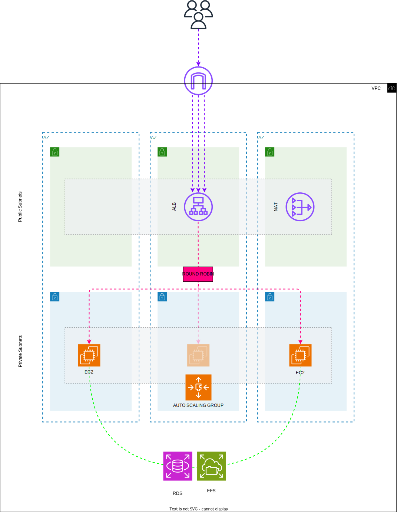

# Atividade Docker - DevSecOps
A segunda etapa de um ciclo de sprints preparatório para DevSecOps envolve a aplicação dos conhecimentos adquiridos na 5ª sprint, que trataram de temas relacionados à AWS (Amazon Web Services) e Docker.

## Requisitos para a Atividade.

### Requisitos AWS:
- Instalação e configuração do Docker no host EC2.
- Configuração do serviço de Load Balacer.
- Configuração do serviço de Auto Scaling.
- Configuração do serviço de RDS database mysql.
- Configuração do serviço de EFS para arquivos estáticos do container de aplicação wordpress.
- Configuração de uma VPC própria.
### Requisitos no Linux:

## Cenário de implementação.

